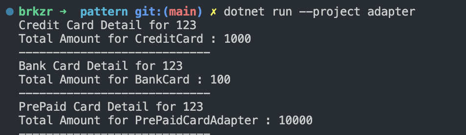

# Adapter Design Pattern
Adaptor design pattern; **yapısal (structural)** design pattern kategorisindedir. Uyumsuz arayüzler (interface) arasında, iş birliği sağlamak amacıyla kullanılır.

Kullanım amacını ve faydalarını özetlemek gerekirse:
- Yeni bir entegrasyon gerektiğinde, objelere ait arayüzler uyumsuz ise kullanılır.
- Eski kodu yeni koda uydurmak yerine, yeni yazılan kodu az bir değişikle eski yapıya uygun olarak kullanabilmemizi sağlar.
- Eski kodda değişiklik gerekmediğinden hata çıkma olasılığı azalır, daha güvenlidir.
---
Git reposundaki örnekte, **ICard** arayüzünden **CreditCard** ve **BankCard** sınıfları türetilmiştir.  **PrePaidCard** sınıfı ise bu arayüzden bağımsız olarak farklı metotlara sahiptir. **PrePaidCardAdaptor**  ile **PrePaidCard**  sınıfı **ICard** arayüzüne uyumlu hale getirilmiştir. 

```c#
var cards = new Type[] { typeof(CreditCard), typeof(BankCard), typeof(PrePaidCardAdapter) };
PrePaidCard prePaidCard = new PrePaidCard();
foreach (var cardType in cards)
{
    var cardObject = (cardType.Equals(typeof(PrePaidCardAdapter)) ? Activator.CreateInstance(cardType, prePaidCard) : Activator.CreateInstance(cardType)) as ICard;
    Console.WriteLine(cardObject?.GetCardDetail(123));
    Console.WriteLine($"Total Amount for {cardObject?.GetType().Name} : {cardObject?.GetTotalAmount(1234)}");
    Console.WriteLine("----------------------------");
}

}
```
Konsol çıktısı : 
