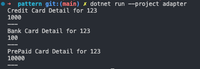

# **Adapter Design Pattern**

 - structural design pattern kategorisindedir.

## Neden kullanılır :  
- Yeni bir entegrasyon gerekti, ama interfaceler (contract) uyuşmuyorsa kullanilabilir.   
- Eski kodu yeni koda uydurmak yerine, yeni yazilan kodu az bir değişikle eski yapıda kullanabilmeyi saglar. 
- Eski kodda degisiklik gerekmediginden hata cikma olasiligi azalir.

