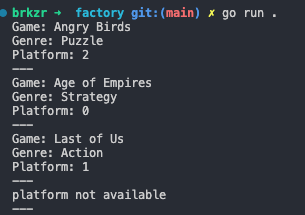

# Factory Design Pattern
Factory design pattern; **yaratımsal (creational)** design pattern kategorisindedir. Nesne yaratmak icin, standart bir mimari sunar.

Kullanım amacını ve faydalarını özetlersek:
- Nesneyi yaratan kodu, nesneyi kullanan koddan ayırır. Bağımlılıkları azaltır.
- Nesneleri standart ve doğru biçimde yaratmayı sağlar.
- Kod içindeki nesnelerin tipleri (type) ve bağımlılıkları (dependency) önceden bilinmiyorsa kullanmak faydalıdır.
- Test yazmayı kolaylaştırır.
- Single Responsibility ve Open/Closed Prensiplerine (**SO**LID) uygunluğu kolaylaştırır.
---
>Repodaki örnekte [Golang](https://go.dev) kullanılmıştır. Class ve kalıtım (inheritance) gibi OOP özelliklerinin bulunmaması nedeniyle, klasik factory pattern, go dilinde uygulanamamaktadır. Ama factory pattern'in basit bir şeklini uygulayabiliriz.

Örnekte, factory pattern kullanılarak  çeşitli platformlara ait oyunlar oluşturulmuştur.

Oyunların temelde sahip olduğu, isim, tür ve platform gibi özellikleri kullanılarak **IGame** arayüzünden (interface); **Game** struct'ı türetilmiştir. Bu struct'tan ise, **PcGame**, **ConsoleGame** ve **MobileGame** adında platforma özel concrete oyunlar türetilmiştir. Yaratılan bu oyunlar dolaylı olarak IGame arayüzüne ait metotları içermektedir. **game_platform_factory** burada istediğimiz platformda oyunlar üreten bir fabrika görevi üstlenmektedir. Bu sayede örnekte bir müşteri görevi üstlenen main metodumuz; farklı platformdan oyunlar oluşturmak için doğrudan PcGame veya ConsoleGame i kullanmak yerine, game_platform_factory e güvenmektedir.

```go
package main

import "fmt"

func createGame(name, genre string, platform Platform) (IGame, error) {
	if platform == Pc {
		return createPcGame(name, genre), nil
	} else if platform == Console {
		return createConsoleGame(name, genre), nil
	} else if platform == Mobile {
		return createMobileGame(name, genre), nil
	}
	return nil, fmt.Errorf("platform not available")
}
```
Konsol çıktısı :



## Kaynaklar
[refactoring.guru](https://refactoring.guru/design-patterns/factory-method)
